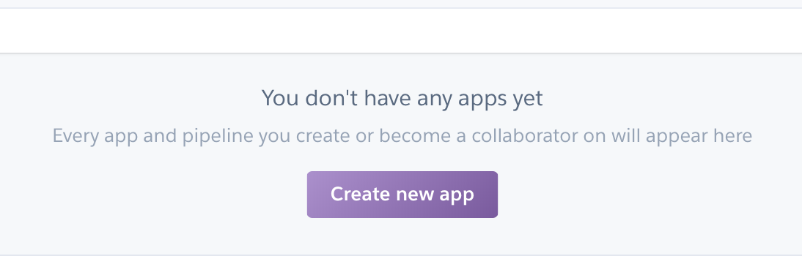
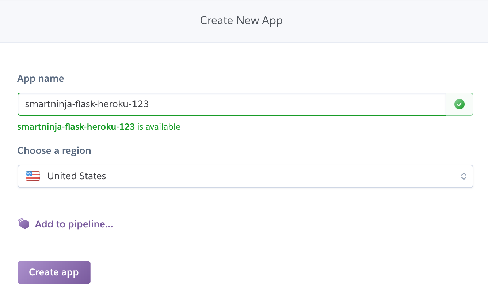
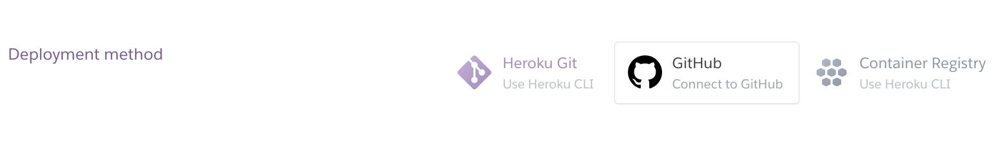
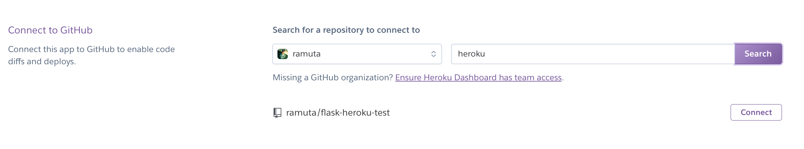
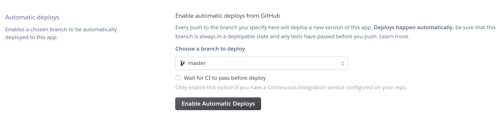
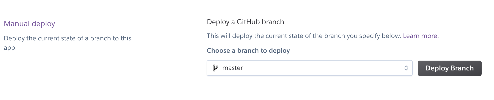
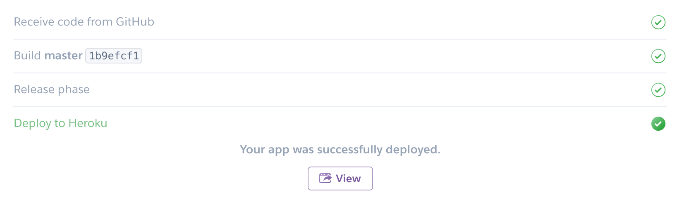
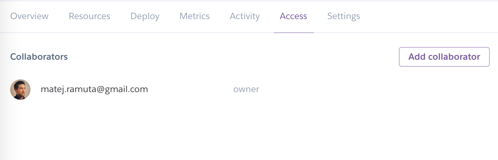
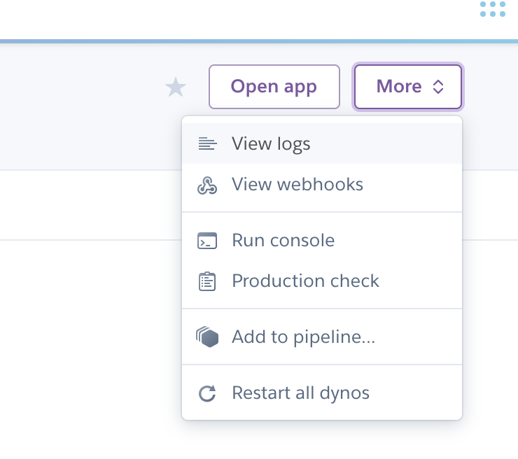

# How to deploy your Flask app to Heroku

## Prerequisites

You'll need to have a GitHub account and a Heroku account.

The tutorial also assumes that you have a Flask web app already created. But you will need to do three more things.

### Add gunicorn in requirements.txt

You requirements.txt file should look like this:

```
Flask==2.0.3
gunicorn==19.9.0
```

### Create a Procfile

Create a file named `Procfile` (no extension, just `Procfile`). It's a text document, but it doesn't have a `.txt` extension.

Add this line of code in it:

```
web: gunicorn main:app
```

This line says that Heroku should use the `gunicorn` web server to run your Flask app. And the location of the Flask app is in the `main.py` file.

### Define runtime

Create another file called **runtime.txt**. Add this line of code in it:

```
python-3.7.0
```

This tells Heroku to use Python 3.7 for your web app.

Push your code to GitHub. Now your web app is ready for deployment!

## Deployment steps

### Step 1: Create new Heroku app

Log into the [Heroku dashboard](https://dashboard.heroku.com/apps) and click on the **Create new app** button:



Enter a unique app name and choose the closest region:



And click on **Create app** button.

### Step 2: Connect to GitHub

A new page will open. Find the **Deployment method** section and click on the **Connect to Github** button.



You will need to confirm your connection between Heroku and GitHub.

Then find your repository and click on the **Connect** button:



### Step 3: Enable automatic deploys

In the section below, click on the **Enable automatic deploys** button (leave everything else as it is.



### Step 4: Manual deploy

The final step is to manually deploy the code which is currently in your GitHub repo. Click on the Deploy Branch button:



You need to do this only for the first deployment. All the next ones will be done automatically.

You can see how the deployment goes in the logs:


After deployment is successfully finished, you will see this message:



Click on the **View** button and voila - your web app is online!

## Heroku features

### Access

You can give access to your Heroku app also to other people:



### Logs

Here you can see what's happening with your web app and find potential errors:



### And much more

Browse your Heroku dashboard to discover other Heroku features.